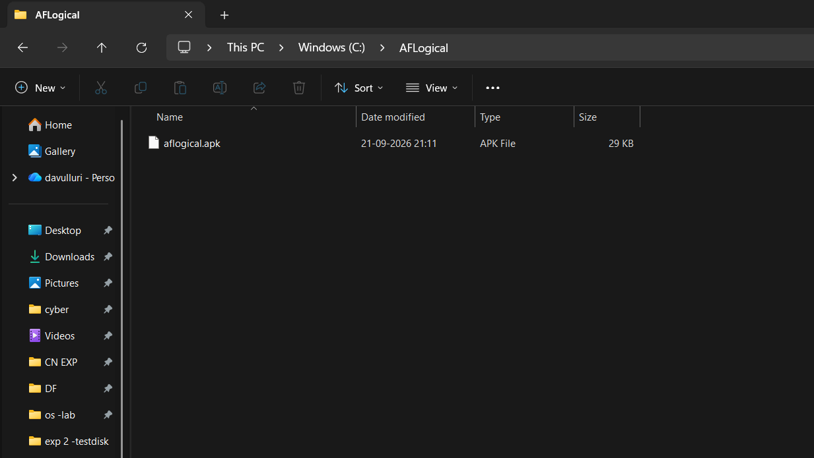
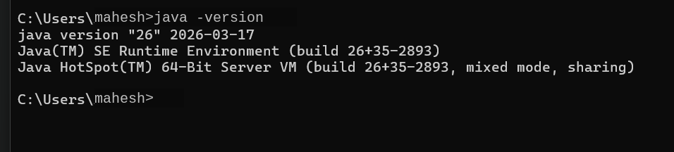
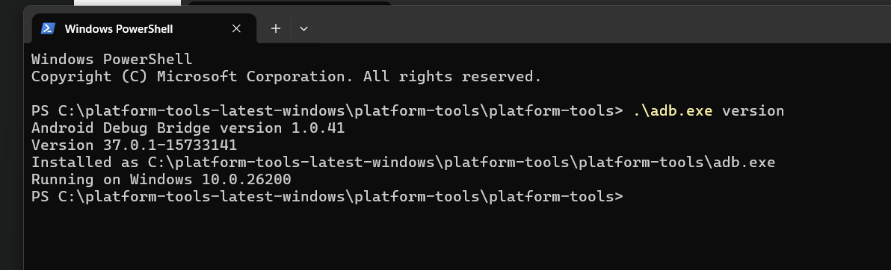
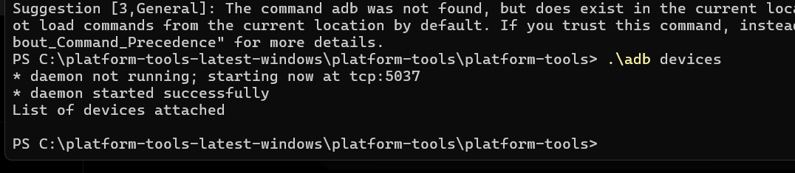
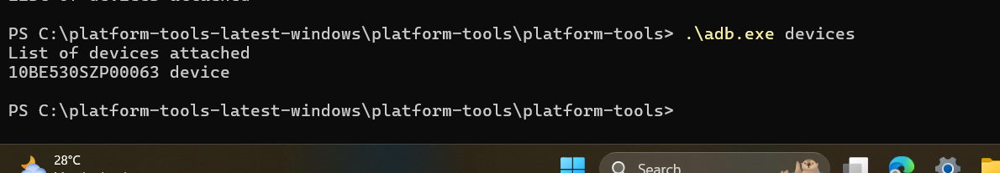
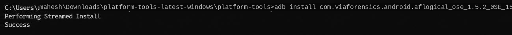
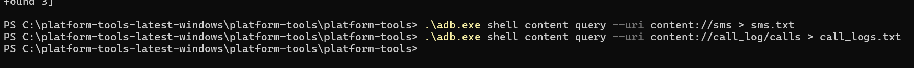
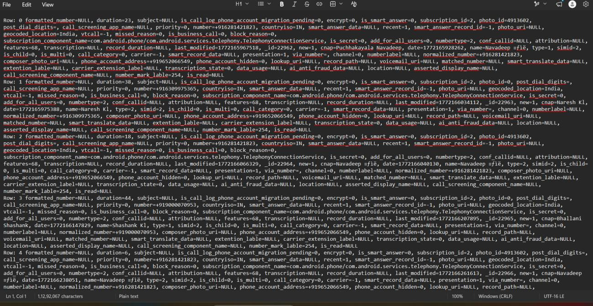
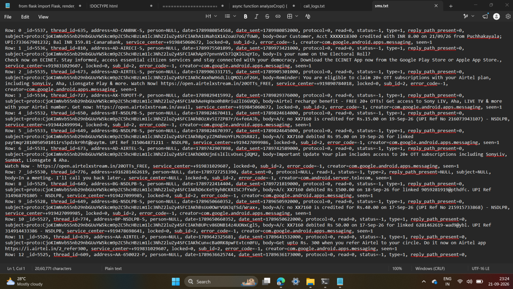

# Experiment. No: 7 Use Aflogical OSE to Extract Data from an Android Device

## Aim

To use AFLogical OSE (Open Source Edition) to perform logical extraction of forensic data from an Android device and recover information such as SMS messages and call logs.

## Objective

- To understand Android logical data extraction.
- To configure the Android Debug Bridge (ADB) environment.
- To connect an Android device to the computer.
- To install and use AFLogical OSE.
- To extract SMS messages from an Android device.
- To extract call log information from an Android device.
- To examine the extracted forensic data.

## Software and Requirements

- Windows Operating System
- Android smartphone
- AFLogical OSE
- Android Debug Bridge (ADB)
- Android Platform Tools
- Java Development Kit (JDK)
- USB cable
- USB Debugging enabled on the Android device
- Text editor for viewing extracted data

## Introduction

AFLogical OSE is an Android forensic data extraction tool used for performing logical acquisition of information from Android devices. It can be used to extract different types of user data, including call logs, SMS messages, contacts, and MMS-related information. The extracted information can then be examined for digital forensic investigation.

## Procedure

### Step 1 – Prepare the AFLogical OSE Application

The AFLogical OSE application package was obtained and placed in a working folder on the computer. The working folder contained the AFLogical application package required for installation on the Android device.

### Step 2 – Verify Java Installation

Java was installed and verified on the computer. The installed Java environment was successfully detected and was ready for use with the Android forensic tools.

### Step 3 – Verify Android Debug Bridge

Android Platform Tools were configured on the computer. ADB was successfully detected and the Android Debug Bridge environment was ready for communication with the Android device.

### Step 4 – Connect the Android Device

The Android device was connected to the computer using a USB cable. USB Debugging was enabled on the Android device. The device was successfully detected by ADB.

### Step 5 – Install AFLogical OSE

The AFLogical OSE application was installed on the connected Android device. The installation completed successfully, confirming that the application was successfully transferred and installed on the device.

### Step 6 – Extract Android Forensic Data

After installation, the AFLogical OSE application was used to obtain logical forensic information from the Android device. The extracted data included SMS messages and call logs. The extracted information was saved as text files on the computer for further examination.

### Step 7 – Examine Call Log Data

The extracted call log information was opened and examined. The recovered data contained information associated with phone calls, including phone numbers, call duration, call date and time, call type, contact information, and other available call-related metadata.

### Step 8 – Examine SMS Data

The extracted SMS information was opened and examined. The recovered SMS records contained information such as sender or recipient address, message content, date and time, message identifiers, message status, and service information.

#### Screenshot 8 – Extracted SMS Data

### Step 9 – Detailed Examination of Extracted Data

The extracted forensic records were further examined to understand the available information. The SMS records contained detailed metadata and message contents. This demonstrated that logical acquisition can recover useful information from an Android device for forensic examination.

## Observations

1. Java was successfully installed and detected.
2. Android Platform Tools were successfully configured.
3. ADB successfully detected the connected Android device.
4. AFLogical OSE was successfully installed on the device.
5. Logical forensic data was successfully extracted.
6. Call log information was recovered.
7. SMS information was recovered.
8. The extracted information contained useful metadata for forensic analysis.

## Result

AFLogical OSE was successfully used to perform logical extraction from an Android device. The experiment successfully recovered call logs and SMS messages, which were examined as part of the forensic analysis.

## Conclusion

This experiment demonstrated the use of AFLogical OSE for Android logical forensic extraction. The Android device was successfully connected to the computer, AFLogical OSE was installed, and forensic information including SMS messages and call logs was successfully extracted and examined. The experiment provided practical knowledge of Android device acquisition and the examination of extracted mobile forensic data.
