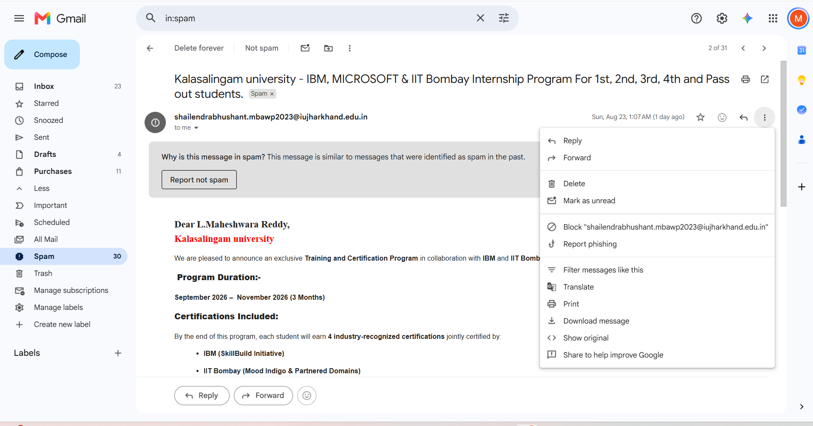
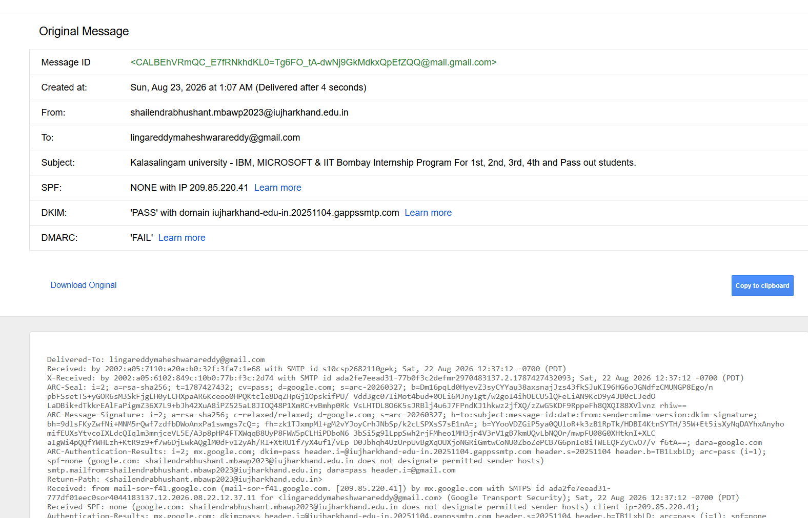
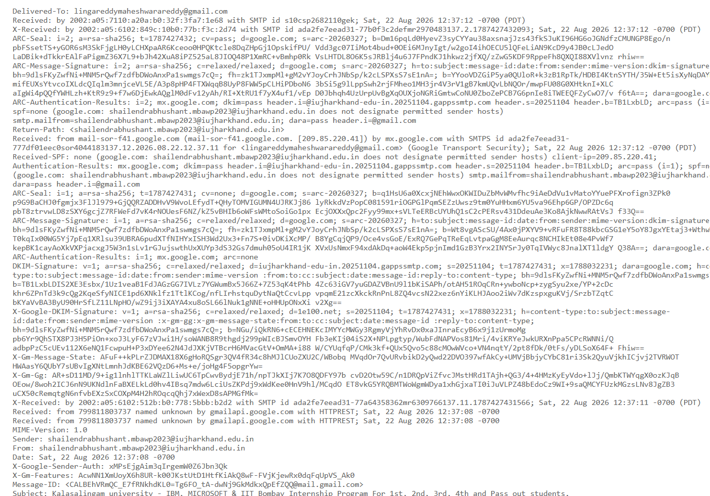
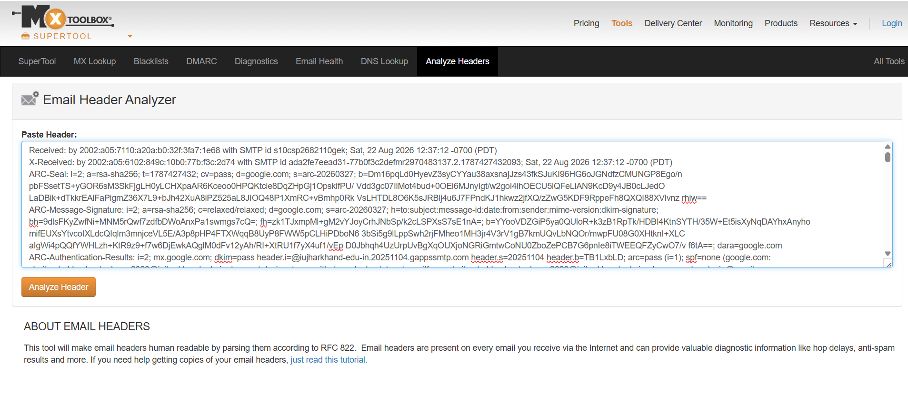
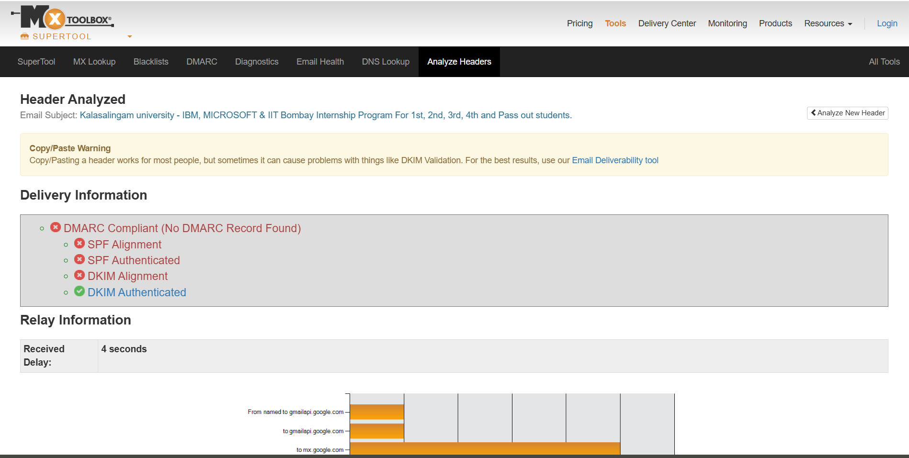

# EXPERIMENT - 4

**MHA – Mail Header Analyzer**

Link: https://mxtoolbox.com/EmailHeaders.aspx

## Procedure

### Step 1: Get the Email Header

First, you need to copy the full, raw header from the email. In Gmail: open the email, click the three dots (■), and select “Show original.” Select all the text in the header and copy it.

*Fig 1: Suspicious email opened in Gmail with the message options menu showing the “Show original” action.*

*Fig 2: “Show original” page displaying the message summary – Message ID, From, To, Subject, SPF, DKIM and DMARC results.*

*Fig 3: Full raw header text below the summary, selected and ready to be copied.*

### Step 2: Use a Mail Header Analyzer

The easiest way to analyze the header is with an online tool. Navigate to a site that analyzes email headers (MxToolbox Email Header Analyzer). Paste the entire header copied in Step 1 into the analysis box. Click the “Analyze Header” button to get a parsed, easy-to-read report.

*Fig 4: Raw header pasted into the MxToolbox Email Header Analyzer input box before clicking Analyze Header.*

### Step 3: Analyze the Report

This is the most critical step. In the analyzer’s report, look for the SPF, DKIM, and DMARC results.

*Fig 5: MxToolbox report showing Delivery Information: DMARC, SPF and DKIM alignment/authentication results.*

#### Review the Overall Delivery Summary

The report shows the message is **not DMARC compliant** – no DMARC record was found for the sending domain. SPF Authenticated and SPF Alignment both failed. DKIM Authenticated passed, but DKIM Alignment failed. Because neither SPF nor DKIM achieves alignment with the visible From domain, the overall DMARC check fails, even though DKIM itself was cryptographically valid.

#### Investigate the SPF Record and Email Path

The header shows `Received-SPF: none`, meaning google.com found that the sender (shailendrabhushant.mbawp2023@iujharkhand.edu.in) does not designate any permitted sender hosts – i.e. the domain iujharkhand.edu.in has not published an SPF record, so the SPF check could not pass. The relay path shows the message was sent from mail-sor-f41.google.com (IP 209.85.220.41) – Google’s own outbound mail infrastructure (Gmail/Google Workspace) – and delivered to mx.google.com.

#### Analyze the DKIM Result

DKIM Authenticated shows **PASS**, signed with domain iujharkhand-edu-in.20251104.gappssmtp.com (Google Workspace’s DKIM signing domain for this tenant). However, **DKIM Alignment failed** because this signing domain does not match the visible From: domain, iujharkhand.edu.in. Since alignment fails for both SPF and DKIM, the message does not satisfy DMARC, despite DKIM itself being valid.

## Result

The Mail Header Analyzer successfully parsed the raw email header and revealed that the message failed DMARC alignment on both SPF and DKIM, even though DKIM authentication itself passed. Since the sending domain (iujharkhand.edu.in) has no published SPF or DMARC policy, this weakens its email authentication posture and makes it easier for such messages to be flagged as spam – exactly as Gmail did with this email. This experiment demonstrates how tools like MxToolbox make it possible to inspect the SPF, DKIM and DMARC trail of an email to judge its authenticity and understand why it may have been marked as spam or potentially spoofed.
