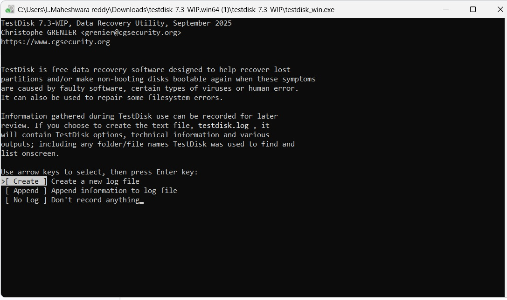
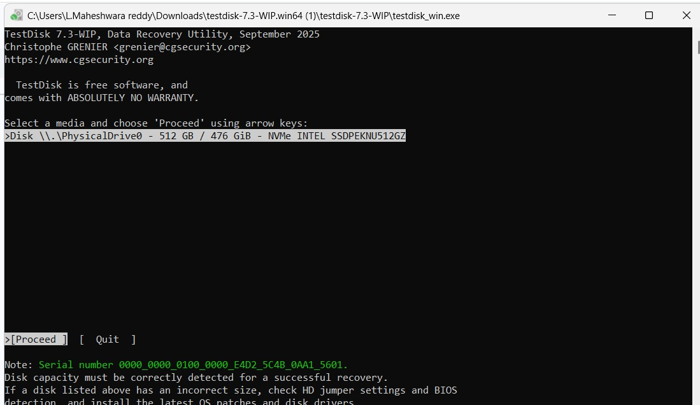
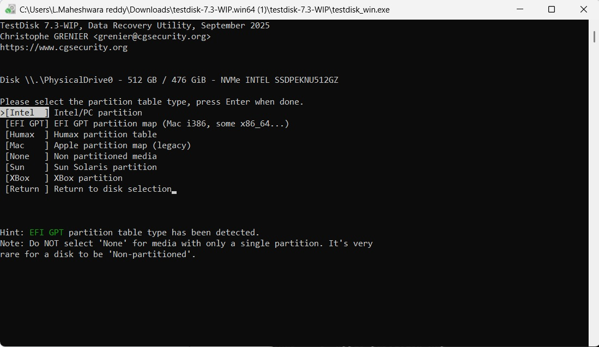
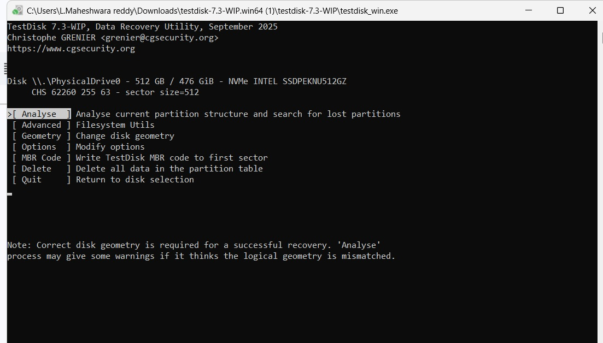
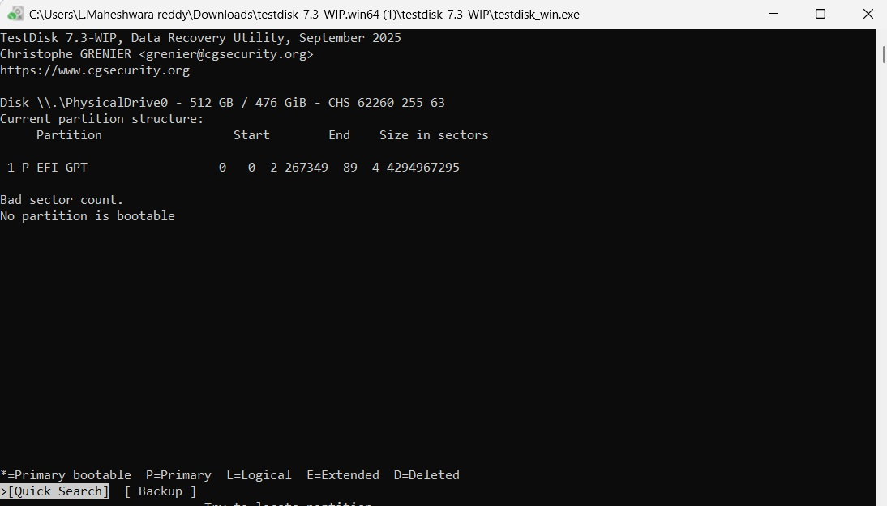
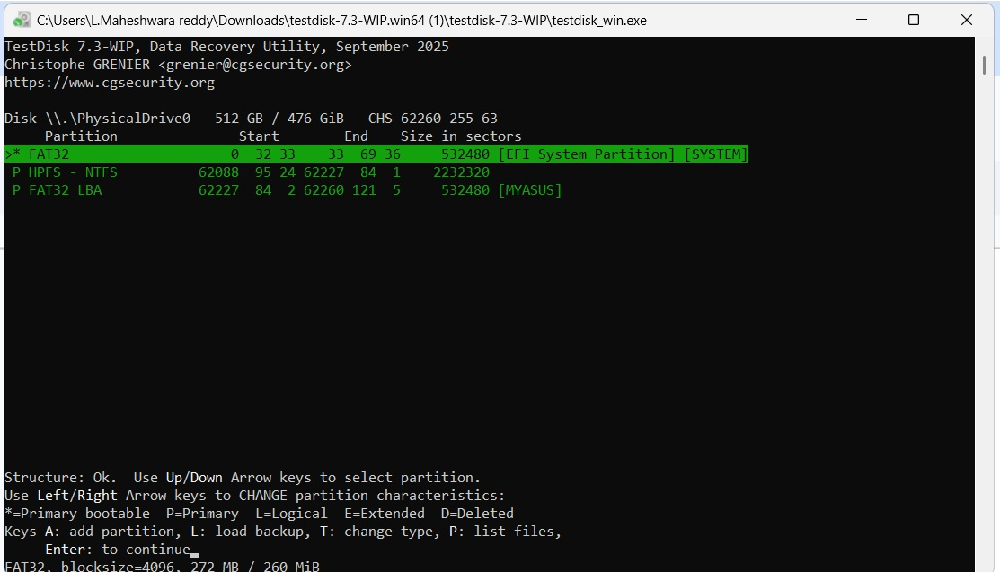
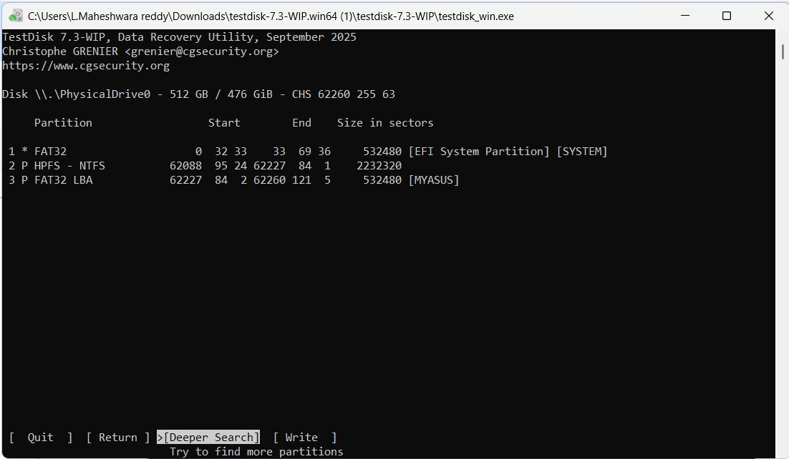
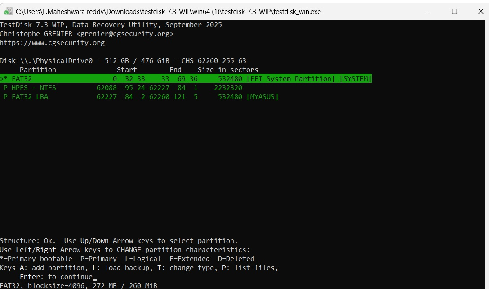
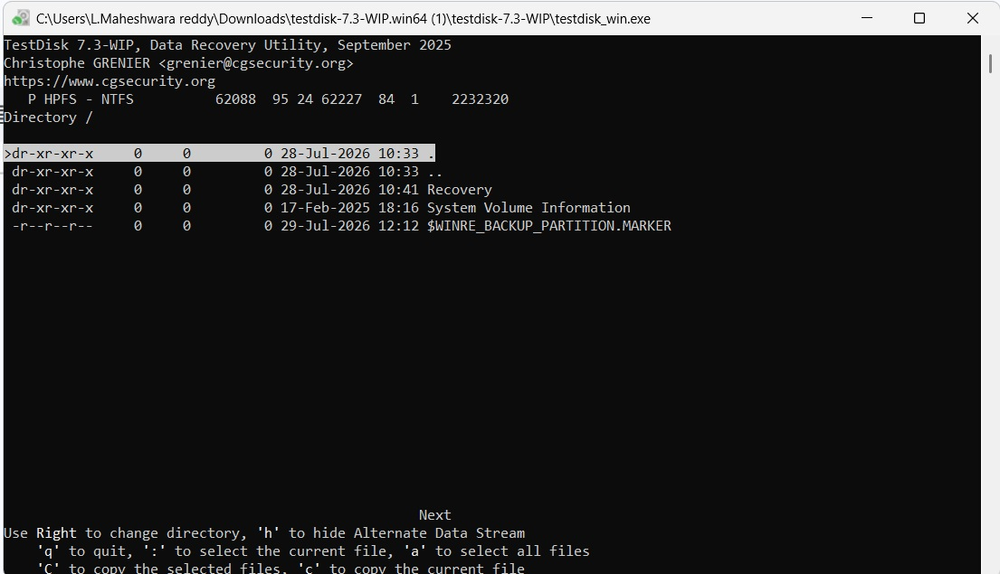
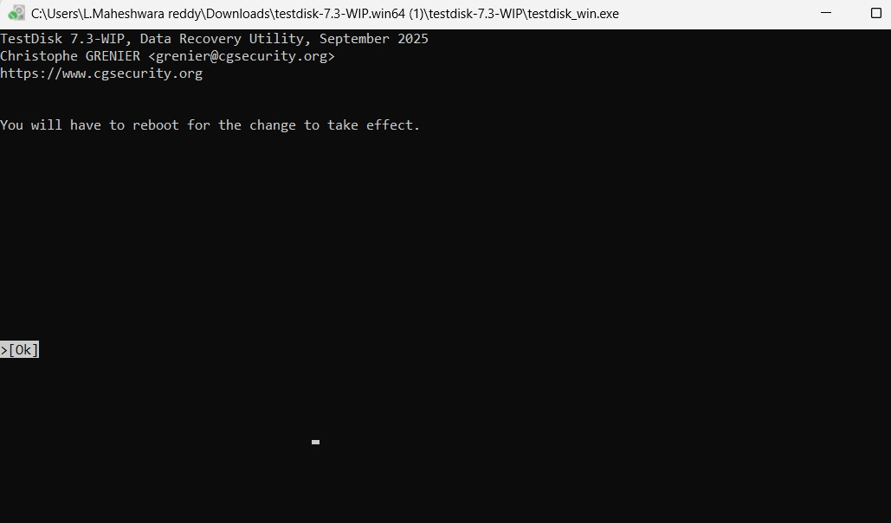

**Ex. No: 2**

# Recover Deleted or Damaged Files from a Storage Device Using TestDisk

## Aim

To recover a missing partition and repair a corrupted partition on a storage device using the TestDisk data recovery tool.

## Description

TestDisk is a free, open-source data recovery utility used to recover lost partitions and repair partition tables, boot sectors, and file systems that have become corrupted, damaged by software, or affected by certain viruses or human error. This exercise demonstrates the step-by-step procedure to recover a missing partition and repair a corrupted one using TestDisk.

## Procedure

### Step 1: Log Creation

Choose Create to instruct TestDisk to create a log file containing technical information and messages, unless there is a reason to append data to an existing log or TestDisk is run from read-only media (in which case the log must be created elsewhere).

Choose None if messages and process details should not be written to a log file (useful when TestDisk is started from a read-only location).

Press Enter to proceed.

### Step 2: Disk Selection

All hard drives are detected and listed with their correct size by TestDisk.

Use the Up/Down arrow keys to select the hard drive containing the lost partition(s).

Press Enter to proceed.

Note: If available, use the raw device /dev/rdisk\* instead of /dev/disk\* for faster data transfer.

### Step 3: Partition Table Type Selection

TestDisk displays the available partition table types.

Select the partition table type — the default value auto-detected by TestDisk is usually correct.

Press Enter to proceed.

### Step 4: Current Partition Table Status

TestDisk displays its menu of options.

Use the default menu option Analyse to check the current partition structure and search for lost partitions.

Confirm Analyse by pressing Enter to proceed.

The current partition structure is now listed. Examine it for missing partitions and errors — for example, a partition listed twice indicates a corrupted partition or an invalid partition table entry, and an invalid NTFS boot message points to a faulty NTFS boot sector (a corrupted file system).

Confirm Quick Search to proceed.

### Step 5: Quick Search for Partitions

TestDisk displays results in real time as it performs the Quick Search.

Once a missing partition is found, highlight it and press ‘p’ to list its files (press ‘q’ to quit back to the previous display). Deleted entries are shown in red.

Verify that all directories and data are correctly listed, then press Enter to proceed.

### Step 6: Save Partition Table or Search for More Partitions

If all partitions are available and the data is correctly listed, go to the Write menu to save the partition structure. The Extd Part menu allows choosing whether the extended partition uses all available disk space or only the minimal required space.

If a partition is still missing, highlight Deeper Search and press Enter to proceed.

### Step 7: Deeper Search (for a Still-Missing Partition)

Deeper Search also looks for the FAT32 backup boot sector, NTFS backup boot superblock, and ext2/ext3 backup superblock to detect more partitions by scanning each cylinder.

After the Deeper Search, review the results — for example, a partition found using its backup boot sector, or a partition shown twice with different sizes because the two entries overlap.

Partitions listed with status D (Deleted) will not be recovered unless their status is changed. When two entries overlap, identify which one is the correct partition to recover.

Highlight each candidate partition and press ‘p’ to list its files to check whether the file system is damaged or intact; press ‘q’ to return to the previous display.

Leave the partition with a damaged file system marked as D (Deleted), and confirm that the correct partition (with its files listed properly) is the one to recover.

### Step 8: Change Partition Status

The available statuses are Primary, \* (bootable), Logical, and Deleted.

Using the Left/Right arrow keys, change the status of the correct partition from D (Deleted) to L (Logical) so that it can be recovered.

Note: If a partition is listed as \*(bootable) but is not the boot partition, its status can be changed to Primary.

Press Enter to proceed.

### Step 9: Partition Table Recovery

It is now possible to write the new partition structure. The extended partition is set automatically, as TestDisk recognises it from the differing partition structure.

Once all partitions are listed correctly, confirm by selecting Write, then press Enter, ‘y’ to confirm, and OK.

The partitions are now registered in the partition table.

### Step 10: NTFS Boot Sector Recovery

If the boot sector of a partition (e.g., Partition 1) is still damaged, it must be repaired. When the boot sector status is Bad and the backup boot sector is Valid, the two boot sectors are not identical.

Select Backup BS to copy the backup boot sector over the damaged boot sector, validate with Enter, confirm with ‘y’, and select OK.

A confirmation message indicates that the boot sector and its backup are now identical — the NTFS boot sector has been successfully recovered.

Press Enter to quit.

TestDisk will prompt that the computer must be restarted to access the recovered data. Press Enter one last time and reboot the computer.

## Result

The missing partition was successfully identified and recovered, the partition table was rewritten with the correct partition structure, and the damaged NTFS boot sector was repaired using its backup boot sector. Thus, the lost data was successfully recovered using TestDisk.
