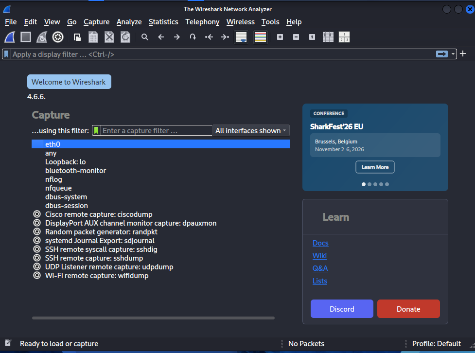
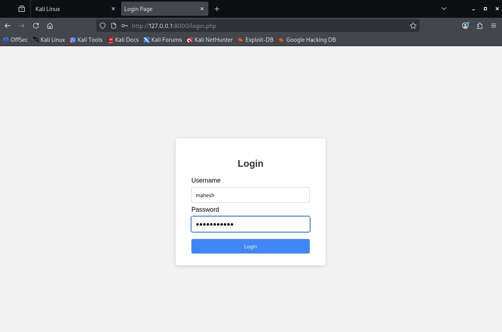
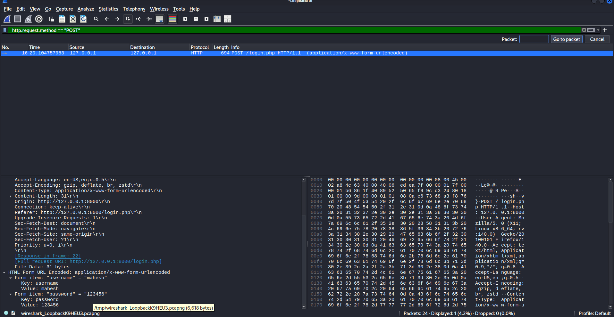
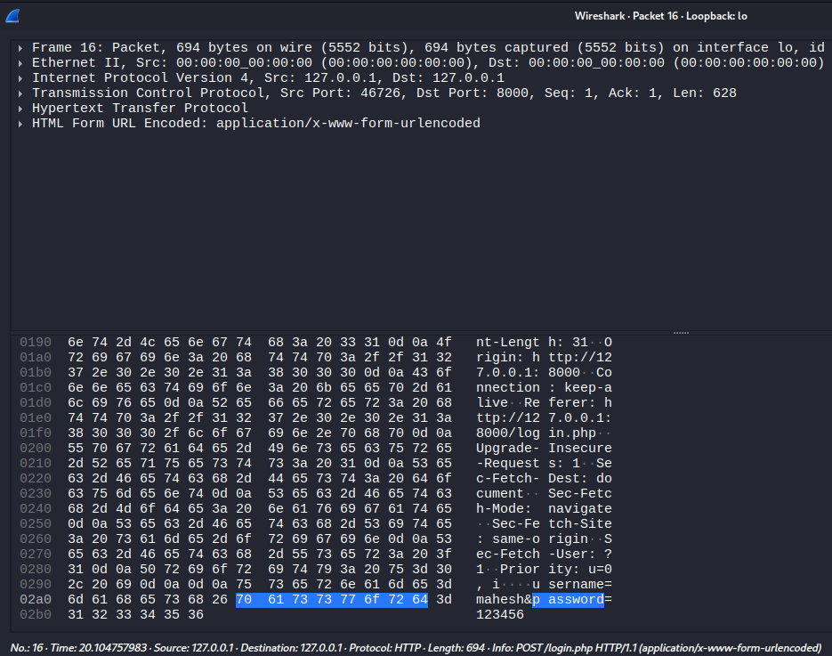
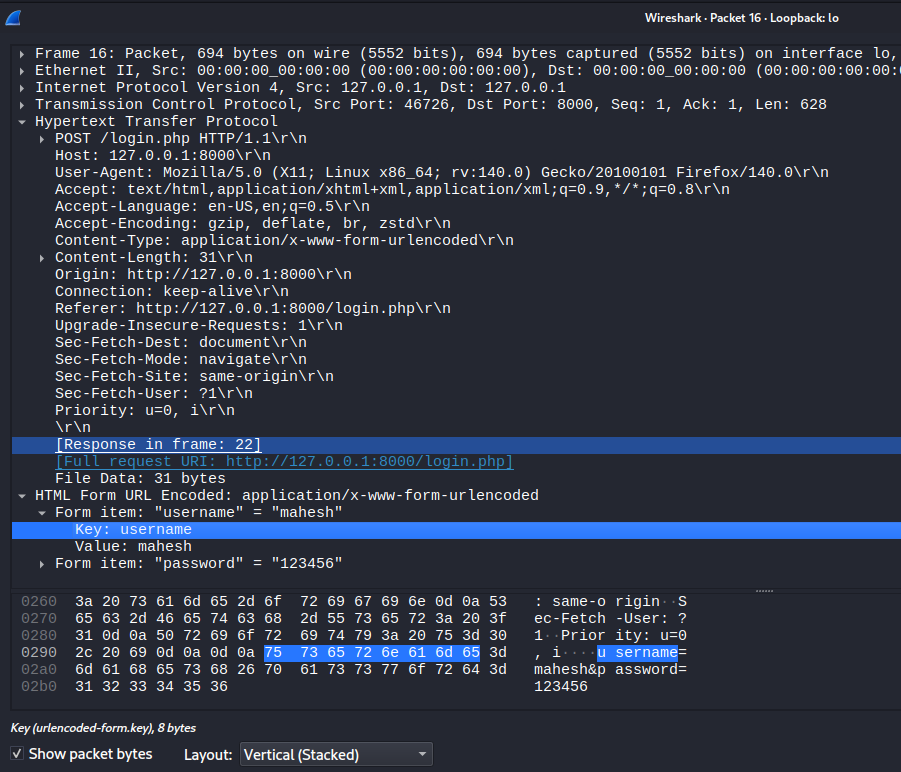

# EXPERIMENT - 3

**Wireshark: Network Packet Capture and Analysis Tool**

## Procedure

### Step 1: Start Capturing Packets

First, open Wireshark. You will see a list of all available network interfaces (e.g., “Wi-Fi,” “Ethernet,” “Loopback: lo”). Select the interface your computer is using to connect to the target (Loopback: lo, since the login page was hosted locally on 127.0.0.1). Click the blue shark fin icon in the top-left corner to start the capture. Wireshark will immediately begin capturing all traffic passing through that interface.



*Fig 1: Wireshark interface selection screen – Loopback: lo selected.*

### Step 2: Generate Login Traffic

Open a web browser and navigate to the login page. Enter any dummy credentials. Click the login button. The login will fail, but the data has already been sent across the network.



*Fig 2: Login page with dummy credentials entered before clicking Login.*

### Step 3: Stop Capture and Filter Traffic

Return to Wireshark and click the Stop button (the red square). In the display filter bar, find the packet containing the login data. Since the form data was sent to the server, look for an HTTP POST request. Apply the following filter to find the exact packet and press Enter:

```
http.request.method == "POST"
```



*Fig 3: Filtered packet list showing the captured POST /login.php HTTP/1.1 request.*

### Step 4: Inspect the Packet to Find Credentials

In the filtered packet list, select the POST packet. In the Packet Details pane below the list, expand the following sections: Hypertext Transfer Protocol → HTML Form URL Encoded. Inside the “HTML Form URL Encoded” section, the credentials entered will be visible in plaintext.



*Fig 4: Packet Details pane showing the Hypertext Transfer Protocol section (collapsed).*



*Fig 5: HTML Form URL Encoded section expanded, revealing the credentials in plaintext.*

## Result

The experiment successfully intercepts the login credentials in a human-readable format. The analysis of the captured POST packet reveals the plaintext data that was transmitted over the network:

```
Form item: "username" = "mahesh"
Form item: "password" = "123456"
```

This result confirms the inherent security flaw of the HTTP protocol. Any sensitive data sent over HTTP is transmitted openly, making it trivial to intercept.
